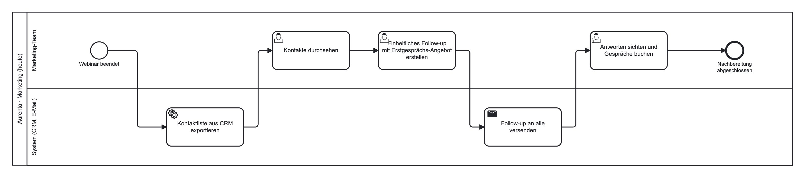
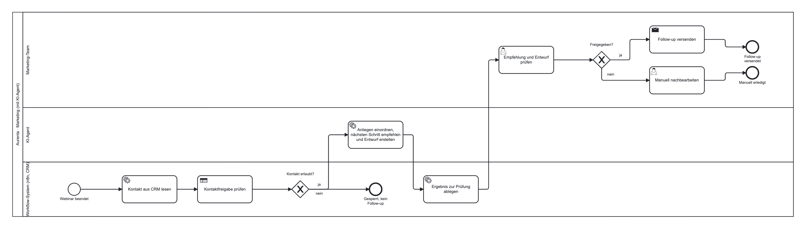

## Der Tag macht aus dem Prototyp einen begründeten Projektzuschnitt

::: {.ws-modules}
::: {.ws-module}
**1 Rückblick**<span>Ein Lauf vom Montag, ein Fehler, eine Ursache</span>
:::
::: {.ws-module}
**2 Briefing**<span>Zoi um 10 Uhr: Angebot, Zielgruppe, heutiger Prozess, gewünschter Nutzen</span>
:::
::: {.ws-module}
**3 Projektbrief**<span>Engpass, Zielgruppe, Hypothese, erster Ablauf und seine Grenze</span>
:::
::: {.ws-module}
**4 Ablaufskizze**<span>Swimlane-Diagramm: wer macht was, Regel oder Modell oder Mensch</span>
:::
::: {.ws-module}
**5 Anweisungen und Ausbau**<span>Regeln, Wissen und Fall trennen, dann in n8n übertragen</span>
:::
::: {.ws-module}
**6 Test und Review**<span>Ein anderes Team prüft, sechs Design-Reviews, Entscheidung für Mittwoch</span>
:::
:::

::: {.notes}
Am Ende des Tages: Projektbrief, aktualisierte Experimentkarte, Ablaufskizze, überarbeiteter Prototyp. Annahmen über Zoi werden von Aussagen aus dem Briefing getrennt, das zieht sich durch den ganzen Tag.
:::

## Rückblick: ein Lauf, ein Fehler, eine Ursache

::: {.ws-cards}
::: {.ws-card .fragment}
[Ursache 1]{.ws-card__tag}

[Daten]{.ws-h}

Falsches Feld, leeres Anliegen, vertauschte Kontakt-ID. Der Fehler entsteht vor dem Modell.
:::
::: {.ws-card .fragment}
[Ursache 2]{.ws-card__tag}

[Anweisung]{.ws-h}

Regel fehlt oder ist unklar. Das Modell tut, was der Prompt zulässt, etwa ein Gespräch trotz Materialwunsch.
:::
::: {.ws-card .fragment}
[Ursache 3]{.ws-card__tag}

[Modell]{.ws-h}

Anweisung und Daten stimmen, die Antwort trotzdem nicht. Erst hier hilft ein anderes Modell oder ein Critic.
:::
:::

::: {.ws-note}
Höchstens 30 Minuten. Ergebnis ist eine überprüfbare Änderung, kein Grundsatzgespräch.
:::

::: {.notes}
Einen konkreten Lauf von gestern an die Wand: Welche Eingabe führte zu welcher Empfehlung? Die drei Ursachen sauber trennen, weil sie drei verschiedene Korrekturen brauchen.
:::

## Drei Fragen pro Team und drei Rollen im Briefing

::: {.ws-compare}
::: {.ws-compare__side .is-left}
[Drei Fragen vorbereiten]{.ws-h}

- eine zu Problem und Ziel
- eine zu Daten und Prozess
- eine zur späteren Nutzbarkeit
:::
::: {.ws-compare__side .is-right}
[Drei Rollen während des Briefings]{.ws-h}

- belegte Aussagen notieren, mit Zeitpunkt
- Annahmen und offene Punkte erkennen
- Fragen stellen
:::
:::

::: {.ws-note}
Etwa 45 Minuten Vorstellung, 15 Minuten Fragen. Die Rollen wechseln beim anschließenden Bearbeiten.
:::

::: {.notes}
Die Fragen von gestern Abend als Ausgangspunkt. Pro Team höchstens drei, damit alle sechs Teams drankommen. Eine geplante Veranstaltung ist noch kein Nachweis einer getroffenen Vereinbarung: Was Zoi vorhat, ist nicht dasselbe wie das, was Zoi tut.
:::

## Belegt, angenommen oder offen: drei Arten von Notizen



::: {.notes}
Am Aurenta-Beispiel geübt, weil das Zoi-Briefing erst um 10 Uhr ist. Belegt heißt: nachlesbar oder vom Partner gesagt, mit Quelle und Zeitpunkt. Annahmen sind erlaubt, sie gehören als Hypothese in den Brief. Offene Fragen werden gesammelt und gestellt.
:::

## Wenn Informationen fehlen, hält der Projektbrief die Lücke fest {.center}

::: {.ws-statement}
Die technische Übung läuft am vollständigen Aurenta-Fall weiter. Auf Zoi übertragen wird nur, was tatsächlich gesagt wurde. Der Übungsfall wird nicht als Angebot des Partners ausgegeben.
:::

::: {.notes}
Praktisch: Im Export steht dann ausdrücklich „Aurenta-Übungsfall“. Lieber eine dokumentierte Lücke als eine erfundene Zoi-Zahl.
:::

# Projektbrief {background-color="#0b0d13"}



## Der Projektbrief beantwortet vier Fragen, bevor Werkzeuge gewählt werden

::: {.ws-cards}
::: {.ws-card .fragment}
[Frage 1]{.ws-card__tag}

[Welcher Engpass?]{.ws-h}

Eine Stelle im Kundenweg, Nutzen und betroffene Zielgruppe. Aussagen mit Quelle, getrennt von Interpretationen.
:::
::: {.ws-card .fragment}
[Frage 2]{.ws-card__tag}

[Welche Hypothese?]{.ws-h}

Wenn X, dann Y, weil Z. Dazu eine alternative Erklärung, verfügbare Daten, geplante Kennzahl.
:::
::: {.ws-card .fragment .is-key}
[Frage 3]{.ws-card__tag}

[Welcher erste Ablauf?]{.ws-h}

Welche Eingabe wird bis Mittwoch zu welcher prüfbaren Ausgabe?
:::
::: {.ws-card .fragment}
[Frage 4]{.ws-card__tag}

[Wo ist die Grenze?]{.ws-h}

Was bleibt ausdrücklich außerhalb des ersten Prototyps? Das schützt vor dem vollständigen Semesterprozess in einem Tag.
:::
:::

::: {.notes}
Vorlage auf der Kursseite. Übung 2.1, etwa eine Stunde: Mitschriften zusammenführen, Engpass wählen, Hypothese formulieren, Ablauf und Grenze festlegen. Das Team entscheidet den Zuschnitt selbst.
:::

## Ein kritischer Chat prüft den Brief, entscheidet aber nicht

```default
Prüfe diesen Projektbrief als kritischer Gesprächspartner.
<Projektbrief hier einfügen.>

Nenne höchstens drei Punkte, an denen Problem, Zielgruppe,
Datenlage oder erwarteter Nutzen noch unklar sind.
Trenne Widersprüche im Text von eigenen Vermutungen.
Schlage für jeden Punkt eine konkrete Klärungsfrage vor.
Erfinde keine Aussagen des Partners und keine verfügbaren Daten.
```

::: {.ws-note}
Das Team dokumentiert, welche Rückmeldungen es übernommen oder verworfen hat. Ergebnis: Projektbrief Version 1.
:::

::: {.notes}
Dieselbe Rolle wie der zweite Chat gestern: Kritik, keine Freigabe. Die letzte Zeile ist wichtig, sonst erfindet das Modell Aussagen des Partners, die es nie gab.
:::

# Ablaufskizze {background-color="#0b0d13"}



## Die Ablaufskizze ist ein Swimlane-Diagramm: eine Bahn je Rolle



::: {.notes}
Notation ist BPMN 2.0, dieselbe wie in Prozessmanagement-Werkzeugen. Für die Übung reichen die drei Bahnen und die sechs Symbole. Symbole anklicken. Werkzeuge: draw.io mit BPMN-Formen oder demo.bpmn.io, beide kostenlos. Ein Foto einer Whiteboard-Skizze ist als erste Fassung zulässig, wenn Bahnen und Entscheidungen erkennbar sind.
:::

## Aurenta heute: alle Kontakte bekommen dieselbe Einladung

{fig-alt="Swimlane-Diagramm des Ist-Prozesses der Webinar-Nachbereitung bei Aurenta."}

::: {.notes}
Von links nach rechts lesen. Der Ist-Prozess hat keinen Modellschritt und keine Unterscheidung nach Anliegen. Das ist der Engpass aus der Hypothese: Die Einladung kommt für einen Teil der Kontakte zu früh.
:::

## Aurenta mit KI-Agent: Sperre, Einordnung, Entwurf, menschliche Freigabe

{fig-alt="Swimlane-Diagramm des Soll-Prozesses: Kontakt aus CRM lesen, Kontaktfreigabe prüfen, KI-Agent ordnet Anliegen ein und erstellt Entwurf, Marketing-Team prüft und gibt frei, Versand durch Mensch."}

::: {.notes}
Die Kontaktsperre liegt als feste Regel im Workflow-System, vor dem Modell. Der KI-Agent ordnet das Anliegen ein und schreibt den Entwurf. Freigabe und Versand bleiben in der Bahn Marketing-Team. Genau das ist der Workflow 02 von gestern, nur als Prozessbild.
:::

## Jeder Schritt ist feste Regel, Modellaufgabe oder menschliche Entscheidung {.center}

::: {.ws-statement}
In der eigenen Skizze wird je Schritt markiert, welche der drei Arten er ist, und wo die Schnittstellen zu Recherche, Content, Follow-up und Reporting liegen. Ein Modellschritt wird nur ergänzt, wenn die Aufgabe ihn begründet.
:::

::: {.ws-note}
Aus der Skizze folgen die drei Testfälle für Mittwoch: normaler Fall, fehlende Information, Grenze oder Sperre.
:::

::: {.notes}
Übung 2.2, etwa 45 Minuten: fachlichen Weg skizzieren, für den gewählten Ausschnitt Eingabe, Verarbeitung, Ausgabe und menschliche Entscheidung ergänzen, Schritt-Typen markieren, Testfälle festlegen. Mehrere Agenten sind kein Qualitätskriterium.
:::

# Anweisungen wiederverwenden {background-color="#0b0d13"}



## Dauerhafte Regeln, Wissen und der aktuelle Fall werden getrennt gepflegt



::: {.notes}
Warum die Trennung: Regeln ändern sich selten, Wissen ändert sich mit dem Angebot, der Fall ändert sich bei jedem Kontakt. Wer alles in einen Prompt schreibt, muss bei jeder Angebotsänderung alles neu prüfen. Anweisungen und Fallpaket werden als Text gespeichert und für jeden Test zusammen mit einem Kontakt in einen neuen Chat eingefügt.
:::

## Kein eigener GPT nötig, aber exportierbare Regeln {.center}

::: {.ws-statement}
Die Übungen verlangen weder einen selbst erstellten GPT noch einen Gem. Gespeicherte Assistenten dürfen genutzt werden, die Regeln müssen aber im Wortlaut dokumentiert und exportierbar bleiben.
:::

::: {.ws-note}
Eine Änderung erhält Versionsnummer, Datum, Grund und betroffene Testfälle. Ein gespeicherter Assistent ist noch kein Agent.
:::

::: {.notes}
Produktfunktionen ändern sich, der Kern der Aufgabe bleibt die überprüfbare Spezifikation. Deshalb Textdateien in der Teamablage, nicht nur Einstellungen in einem Konto.
:::

## Eine Antwort aus ChatGPT ist nicht dieselbe Antwort in n8n {.center}

::: {.ws-statement}
Modell, Zusatzfunktionen, Verlauf und Einstellungen können abweichen. Nach der Übertragung in die Basic LLM Chain werden die Testfälle deshalb erneut ausgeführt.
:::

::: {.notes}
Übung 2.3, etwa 75 Minuten: Regeln vom Fall trennen, im neuen Chat prüfen, dieselbe Aufgabe in n8n übertragen, eine gezielte Erweiterung wählen (strukturierte Felder, feste Kontaktsperre oder passendere Materialauswahl), einen Fall vor und nach der Änderung prüfen, Export und Änderungsgrund ablegen. Bedienung wechseln.
:::

## Gegenseitiger Test: ein Fall, die Kriterien, keine Erklärung

::: {.ws-task}
**Teampaare 1 und 2, 3 und 4, 5 und 6. Etwa 20 Minuten pro Richtung.**

- Das testende Team bekommt einen Fall und die vorher vereinbarten Kriterien.
- Es bekommt **keine** Erklärung, warum das Ergebnis angeblich gut ist.
- Es prüft den tatsächlichen Lauf und benennt einen belegten Befund.
- Danach entscheidet das verantwortliche Team über eine Änderung.
:::

::: {.notes}
Der Sinn: Ein Prototyp muss ohne seine Erbauer funktionieren. Das ist die Vorstufe zum Playbook am Mittwoch und zur Übergabe an Zoi.
:::

## Design-Review: vier Punkte in sechs Minuten

::: {.ws-task}
1. Problem und Datenlage
2. Ein funktionierender Ausschnitt
3. Ein offener Test
4. Entscheidung für Mittwoch

Das Review bestätigt einen bearbeitbaren nächsten Schritt. Es verlangt noch keinen vollständigen Semesterprozess.
:::

::: {.notes}
Sechs Teams, sechs Minuten, gemeinsamer Puffer. Rückmeldung bezieht sich auf Begründung und Funktion, nicht auf Folien. Morgen: Testen, vergleichen, übergeben.
:::
