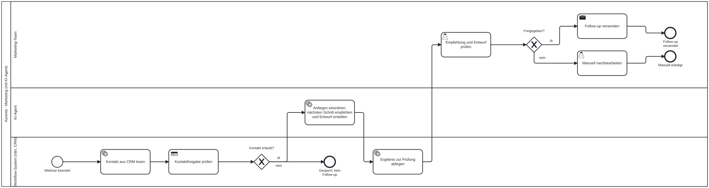

[22. September 2026 · 09:00–17:00 Uhr · Briefing mit Zoi um 10:00 Uhr]{.kicker}

[Der erste Prototyp schafft eine gemeinsame Sprache für das Briefing. Heute wird daraus ein begründeter Projektzuschnitt mit einem klaren ersten Ablauf.]{.lead}

## Ziel und Tagesergebnis

Jedes Team erstellt einen Projektbrief, eine aktualisierte Experimentkarte, eine Ablaufskizze und einen überarbeiteten n8n-Prototyp. Ein anderes Team prüft einen Fall. Annahmen über Zoi werden von Aussagen aus dem Briefing getrennt.

## Bausteine des Tages {#bausteine}

Fest sind Beginn um 09:00 Uhr, die Mittagspause von 13:00 bis 14:00 Uhr und das Ende um 17:00 Uhr. Dazwischen arbeiten wir in Bausteinen. Die Dauer ist eine Schätzung; Reihenfolge und Umfang passen wir daran an, wie die Teamarbeit läuft. Kurze Pausen legen wir nach Bedarf ein. Fest liegt heute zusätzlich das Briefing durch Zoi ab 10:00 Uhr.

| Baustein | Dauer | |
|---|---|---|
| Rückblick auf Montag, ein gemeinsamer Fehler und seine Ursache | ca. 30 Min | |
| Fragen bündeln und Briefing vorbereiten | ca. 30 Min | |
| **Zoi-Briefing einschließlich Rückfragen** | ca. 60 Min | **fest ab 10:00 Uhr** |
| Übung 2.1: Projektbrief und erster Zuschnitt | ca. 60 Min | |
| Übung 2.2: Kundenweg und Ablauf entwerfen | ca. 45 Min | |
| Übung 2.3: Anweisungen und Workflow übertragen | ca. 75 Min | |
| Gegenseitiger Test: drei Teampaare | ca. 45 Min | |
| Design-Reviews und Entscheidung für Mittwoch | ca. 45 Min | |

## Rückblick und Briefingvorbereitung

::: {.folien .folien-inline}
[Folien]{.folien-label}

<ul><li><a class="folie" href="../slides/tag2-briefing.html" target="_blank" rel="noopener">Vom Übungsfall zum Zoi-Auftrag <span>Rückblick, Briefing, Projektbrief, Ablaufskizze</span></a></li></ul>
:::

Ein konkreter Lauf vom Montag wird gemeinsam betrachtet: Welche Eingabe führte zu welcher Empfehlung? Lag ein Problem in den Daten, der Anweisung oder im Modell? Der Rückblick dauert höchstens 30 Minuten und führt zu einer überprüfbaren Änderung.

Je Team eine Frage zu Problem und Ziel, eine zu Daten und Prozess und eine zur späteren Nutzbarkeit priorisieren. Während des Briefings werden drei Aufgaben verteilt: belegte Aussagen notieren, Annahmen und offene Punkte erkennen, Fragen stellen. Die Aufgaben wechseln beim anschließenden Bearbeiten.

## Briefing des Projektpartners ab 10:00 Uhr {#briefing}

Geplant sind etwa 45 Minuten Vorstellung und 15 Minuten Fragen, vor Ort an der HdM. Angebot, Zielgruppe, heutiger Prozess und gewünschter Nutzen werden anhand des Briefings konkretisiert. Eine geplante Veranstaltung ist noch kein Nachweis einer getroffenen Vereinbarung.

::: {.callout-note title="Wenn Informationen noch fehlen"}
Der Projektbrief hält die Lücke fest. Die technische Übung wird am vollständigen Aurenta-Fall fortgeführt. Eine Übertragung auf Zoi wird nur dort vorgenommen, wo tatsächliche Informationen vorliegen. Der Übungsfall wird nicht als Angebot des Partners ausgegeben.
:::

## Übung 2.1: Ein bearbeitbares Problem {#uebung-2-1}

::: {.uebung}
### ca. 60 Minuten · Dreierteams

**Material:** Mitschrift, [Projektbrief](https://docs.google.com/document/d/1Jwbhg5CbI-mxCJvRw1oSLBkLR7ZoPOQrwN0jsluFtIM/edit), [Experimentkarte](https://docs.google.com/document/d/1JrrMgJ6fCEae3trCWNqdAonEc9EHbZ-PWskl8wtli-s/edit).

1. Mitschriften zusammenführen: Aussagen mit Quelle und Zeitpunkt von Interpretationen trennen (15 Minuten).
2. Einen Engpass im Kundenweg wählen. Nutzen und betroffene Zielgruppe beschreiben, bevor Werkzeuge ausgewählt werden (15 Minuten).
3. Hypothese und alternative Erklärung formulieren. Verfügbare Daten und geplante Wirkungsmetrik benennen (15 Minuten).
4. Einen ersten Ablauf und dessen Grenze festlegen: Welche Eingabe wird bis Mittwoch zu welcher prüfbaren Ausgabe? Was bleibt außerhalb dieses ersten Prototyps? (15 Minuten).

```default
Prüfe diesen Projektbrief als kritischer Gesprächspartner.
<Projektbrief hier einfügen.>

Nenne höchstens drei Punkte, an denen Problem, Zielgruppe,
Datenlage oder erwarteter Nutzen noch unklar sind.
Trenne Widersprüche im Text von eigenen Vermutungen.
Schlage für jeden Punkt eine konkrete Klärungsfrage vor.
Erfinde keine Aussagen des Partners und keine verfügbaren Daten.
```

**Ergebnis:** Projektbrief Version 1. Das Team entscheidet selbst über den Zuschnitt und dokumentiert, welche KI-Rückmeldungen es übernommen oder verworfen hat.
:::

## Übung 2.2: Den Kundenweg und den Ablauf verbinden {#uebung-2-2}

::: {.uebung}
### ca. 45 Minuten · Dreierteams

**Material:** Projektbrief und Workflow vom Montag, [Lesehilfe Ablaufskizze](https://docs.google.com/document/d/1pO28YSUSkvbrn8drNZqMMVqimBHT2fiyT0LEfXeF_tY/edit), Beispiel Aurenta heute ([Bild](../material/prozess/aurenta-webinar-ist.svg) · [BPMN](../material/prozess/aurenta-webinar-ist.bpmn)) und mit KI-Agent ([Bild](../material/prozess/aurenta-webinar-soll.svg) · [BPMN](../material/prozess/aurenta-webinar-soll.bpmn)).

1. Den fachlichen Weg von Interesse bis zu einem nächsten sinnvollen Schritt skizzieren (10 Minuten).
2. Für den gewählten Ausschnitt Eingabe, Verarbeitung, Ausgabe und menschliche Entscheidung ergänzen (15 Minuten).
3. Je Schritt feste Regel, Modellaufgabe oder menschliche Entscheidung markieren. Schnittstellen zu Recherche, Content, Follow-up und Reporting sichtbar machen (10 Minuten).
4. Die drei Testfälle für Mittwoch festlegen: normaler Fall, fehlende Information, Grenze oder Sperre (10 Minuten).

Die Skizze wird als Swimlane-Diagramm gezeichnet: eine Bahn je Rolle (Marketing-Team, KI-Agent, Workflow-System), der Schritt-Typ steckt im Symbol. Das Aurenta-Beispiel zeigt beide Stände. Werkzeug nach Wahl: draw.io mit BPMN-Formen oder demo.bpmn.io; ein Foto einer Whiteboard-Skizze ist als erste Fassung ebenfalls zulässig, wenn Bahnen und Entscheidungen erkennbar sind.

[{.infografik fig-alt="Swimlane-Diagramm des Soll-Prozesses: Kontakt aus CRM lesen, Kontaktfreigabe prüfen, KI-Agent ordnet Anliegen ein und erstellt Entwurf, Ergebnis zur Prüfung ablegen, Marketing-Team prüft und gibt frei, Versand durch Mensch."}](../material/prozess/aurenta-webinar-soll.svg)

**Ergebnis:** Eine verständliche Swimlane-Skizze mit eindeutigen Feldnamen, abgelegt im Drive-Ordner des Teams. Mehrere Agenten sind kein Qualitätskriterium. Ein Modellschritt wird nur ergänzt, wenn die Aufgabe ihn begründet.
:::

## Übung 2.3: Wiederverwendbare Anweisungen und ein erster Ausbau {#uebung-2-3}

::: {.folien .folien-inline}
[Folien]{.folien-label}

<ul><li><a class="folie" href="../slides/n8n-workflows.html" target="_blank" rel="noopener">n8n: Workflows und Agenten <span>Abschnitt Ausbau</span></a></li></ul>
:::

::: {.uebung}
### ca. 75 Minuten · Dreierteams, Bedienung wechseln

**Material:** [Anweisungen](https://docs.google.com/document/d/1SIYpnRHpPq9tb5qiE0-Ixu8o4xy0_5NJHvM-DgZ0LYc/edit), [Assistenten-Bausteine](../werkzeuge/assistenten.qmd), [n8n-Anleitung](../werkzeuge/workflows.qmd#ausbau).

1. Dauerhafte Regeln vom jeweiligen Kontaktfall trennen. Angebotswissen als gesonderte Grundlage benennen (15 Minuten).
2. Einen neuen Chat mit Regeln, Wissen und einem Fall ausführen. Ohne eigene GPTs oder andere Bezahlfunktionen (15 Minuten).
3. Dieselbe Aufgabe in n8n übertragen. Eine gezielte Erweiterung auswählen: strukturierte Felder, feste Kontaktsperre oder passendere Materialauswahl (30 Minuten).
4. Einen Fall vor und nach der Änderung prüfen und Export sowie Änderungsgrund ablegen (15 Minuten).

**Ergebnis:** Ein überarbeiteter lauffähiger Ablauf. Bei unvollständigem Zoi-Material steht im Export ausdrücklich „Aurenta-Übungsfall“. Die Ausgaben bleiben Entwürfe.
:::

## Gegenseitiger Test

Teampaare: 1 und 2, 3 und 4, 5 und 6. Pro Richtung etwa 20 Minuten, fünf Minuten gemeinsame Entscheidung. Das testende Team erhält einen Fall und die vorher vereinbarten Kriterien, aber keine Erklärung, warum das Ergebnis angeblich gut ist. Es prüft den tatsächlichen Lauf und benennt einen belegten Befund. Anschließend entscheidet das verantwortliche Team über eine Änderung.

## Design-Reviews

Pro Team sechs Minuten, neun Minuten gemeinsamer Puffer: Problem und Datenlage, ein funktionierender Ausschnitt, ein offener Test, Entscheidung für Mittwoch. Das Review bestätigt einen bearbeitbaren nächsten Schritt. Es verlangt noch keinen vollständigen Semesterprozess.

::: {.folien}
[Alle Folien zu diesem Tag]{.folien-label}

Die Präsentationen öffnen sich in einem neuen Tab.

<ul>
<li><a class="folie" href="../slides/tag2-briefing.html" target="_blank" rel="noopener">Vom Übungsfall zum Zoi-Auftrag <span>Briefing, Projektbrief, Ablaufskizze, Anweisungen</span></a></li>
<li><a class="folie" href="../slides/n8n-workflows.html" target="_blank" rel="noopener">n8n: Workflows und Agenten <span>Abschnitt Ausbau: Sperre, Parser, Agent</span></a></li>
</ul>
:::

Wie es am Mittwoch weitergeht, sehen wir am Mittwochmorgen.
