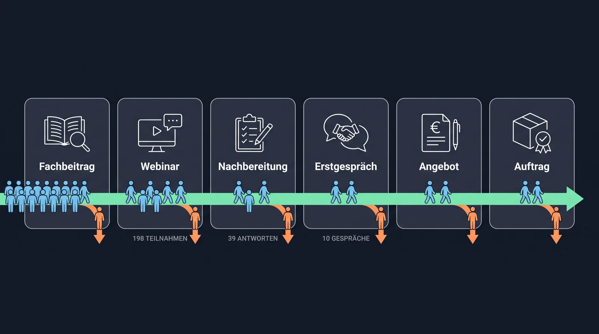
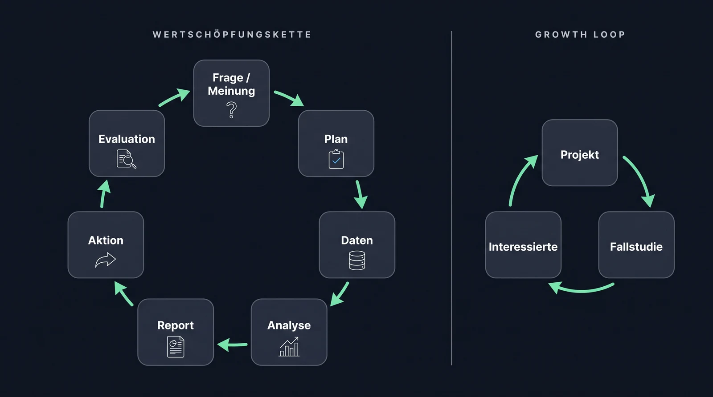
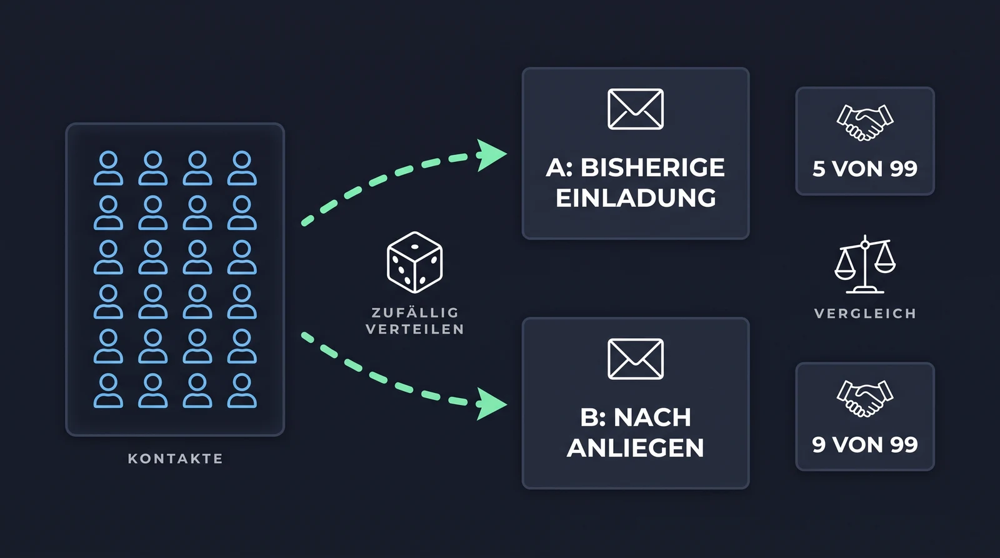

[Growth Marketing heißt: den Kundenweg kennen, die Stelle mit dem größten Verlust finden, eine Änderung als Hypothese formulieren und ihre Wirkung messen. Diese Seite liefert das Raster dafür am Fall Aurenta.]{.lead}

## Der Kundenweg

Bei Aurenta führt der Weg vom Fachbeitrag über das Webinar und die Nachbereitung zum Erstgespräch, Angebot und Auftrag. An jedem Übergang gehen Kontakte verloren, und die Gründe unterscheiden sich: fehlendes Vertrauen, falscher Zeitpunkt, unklarer Nutzen. Deshalb braucht jeder Übergang eine eigene Maßnahme.

{.abbildung fig-alt="Kundenweg bei Aurenta: Fachbeitrag, Webinar, Nachbereitung, Erstgespräch, Angebot, Auftrag. An jeder Station verlassen Personen den Weg."}

::: {.abb-cap}
Der Kundenweg bei Aurenta mit den Zahlen aus den drei Kampagnen. Der größte Verlust liegt zwischen Nachbereitung und Erstgespräch.
:::

Vier Begriffe, die im Projekt ständig vorkommen:

- **Lead:** ein Kontakt, der zur Zielgruppe passt und ein erkennbares Anliegen hat. Kein sicherer Auftrag.
- **Qualifizierung:** die Prüfung, ob ein Lead zum Angebot passt, anhand vorher festgelegter Kriterien (bei Aurenta: benannte Marketingaufgabe, geklärte Zuständigkeit, passender nächster Schritt).
- **Conversion:** ein vorher definierter Übergang, etwa vom Follow-up zum gebuchten Gespräch.
- **Conversion-Rate:** Zähler, Nenner und Zeitraum. „16 Buchungen von 198 Follow-ups innerhalb von 14 Tagen" ist eine Rate, „16 Buchungen" allein nicht.

## AARRR als Raster

| Bereich | Frage | Bei Aurenta |
|---|---|---|
| Acquisition | Wie entsteht ein passender Erstkontakt? | Anmeldung zum Webinar über einen Fachbeitrag |
| Activation | Wann erlebt der Kontakt zum ersten Mal konkreten Nutzen? | Eine Arbeitshilfe hilft bei der Auswahl eines eigenen KI-Anwendungsfalls |
| Retention | Warum bleibt die Beziehung relevant? | Weitere passende Inhalte, erneute Zusammenarbeit |
| Referral | Wann wird das Angebot weiterempfohlen? | Eine zufriedene Kundin stellt einen Kontakt her |
| Revenue | Wie entsteht Umsatz? | Beauftragter Praxischeck |

Im Blockkurs geht es um den Übergang von Acquisition zu Activation: vom Webinar-Kontakt zum qualifizierten Gespräch. Die anderen Bereiche kommen im Semesterprojekt je nach Zuschnitt mit Zoi dazu.

## Wertschöpfungskette und Growth Loop

Von der Frage zur Aktion führt eine Kette aus sieben Stufen. Sie stammt aus der Datenanalyse und gilt für jedes Marketingexperiment, bei Netflix genauso wie bei Aurenta.

| Stufe | Was passiert | Bei Aurenta |
|---|---|---|
| Frage / Meinung | Eine Frage aus dem Geschäft und eine Meinung dazu, gestützt auf Erfahrung oder Literatur | Warum führen nur 10 von 198 Follow-ups zu einem Gespräch? Meinung: Nachbereitung nach Anliegen bringt mehr Gespräche |
| Plan | Problem, Kennzahl und Studiendesign festlegen | Gesprächsquote = qualifizierte Gespräche ÷ Follow-ups in 14 Tagen; A/B-Test mit Kontroll- und Treatment-Gruppe |
| Daten | Daten erheben und aufbereiten | Je Kontakt: Gruppe und Ergebnis |
| Analyse | Kennzahlen berechnen, Modelle bauen | Kreuztabelle Gruppe gegen Ergebnis, Zeilenanteile vergleichen |
| Report | Schlüsse ziehen und kommunizieren | Starker Hinweis für die Treatment-Gruppe, noch kein statistischer Test |
| Aktion | Auf die Schlüsse handeln | Einladung noch nicht ersetzen, Test mit ausreichender Fallzahl planen |
| Evaluation | Wirkung der Aktion prüfen | Gesprächsquote weiter beobachten, daraus entsteht die nächste Frage |

So arbeitet das Team im Projekt: Jede Änderung am Workflow durchläuft diese Kette, in den Blocktagen im Kleinen (Testprotokoll statt Feldversuch), im Semester im Großen (Messdesign). Referenzfall aus der Statistik-Vorlesung: Netflix testet, ob eine andere Darstellung des Box-Art die Klickrate erhöht, mit demselben Aufbau (Tingley et al. 2021, „Decision Making at Netflix").

**Growth Loop:** Ein Ergebnis wird zum Input für den nächsten Durchlauf. Beispiel für eine Beratung: Ein abgeschlossenes Projekt wird zur Fallstudie, die Fallstudie zieht passende Interessierte an, daraus entstehen neue Projekte und neue Fallstudien. Der Begriff stammt von [Reforge](https://www.reforge.com/blog/growth-loops).

{.abbildung fig-alt="Links die Wertschöpfungskette mit sieben Stufen von Frage bis Evaluation im Kreis, rechts der Growth Loop aus Projekt, Fallstudie und Interessierten."}

::: {.abb-cap}
Links die Wertschöpfungskette: Die Evaluation führt zur nächsten Frage. Rechts der Growth Loop: Das Ergebnis eines Durchlaufs ist der Input für den nächsten.
:::

## Vom Material zur Hypothese

So sehen die ersten Stufen der Kette am Fall Aurenta aus:

- **Beobachtung:** 198 Follow-ups führten zu 16 Buchungen und 10 qualifizierten Gesprächen. Von den Kontakten, die nur nachlesen wollten, hat 1 von 60 ein Gespräch gebucht, von denen mit Gesprächswunsch 10 von 28.
- **Mögliche Erklärungen:** Die einheitliche Gesprächseinladung kommt für einen Teil der Kontakte zu früh. Oder: Angebot oder Zeitpunkt passen nicht.
- **Hypothese:** Wenn die Nachbereitung den geäußerten Informationsbedarf berücksichtigt, entstehen innerhalb von 14 Tagen häufiger qualifizierte Gespräche als bei einer einheitlichen Gesprächseinladung, weil der nächste Schritt zur Situation des Kontakts passt.
- **Plan:** Vergleichbare Kontakte werden zufällig auf eine Kontrollgruppe (bisherige Einladung) und eine Treatment-Gruppe (Nachbereitung nach Anliegen) verteilt, die Regeln stehen vorher fest, gezählt werden die durchgeführten qualifizierten Gespräche je Gruppe.

Die [Experimentkarte](https://docs.google.com/document/d/1JrrMgJ6fCEae3trCWNqdAonEc9EHbZ-PWskl8wtli-s/edit) hält Beobachtung, Hypothese und Kennzahl in dieser Reihenfolge fest.

## A/B-Test: die Hypothese prüfen {#ab-test}

Ein A/B-Test vergleicht zwei Gruppen unter gleichen Bedingungen: die **Kontrollgruppe** A bekommt das Bisherige, die **Treatment-Gruppe** B die Änderung. Vier Regeln entscheiden darüber, ob das Ergebnis etwas aussagt:

1. **Zufällige Zuteilung.** Welcher Kontakt in welche Gruppe kommt, entscheidet der Zufall, nicht die Person, die den Kontakt bearbeitet. Sonst landen die vielversprechenden Kontakte in der Treatment-Gruppe.
2. **Nur eine Änderung.** Wer Text, Zeitpunkt und Absender gleichzeitig ändert, weiß am Ende nicht, was gewirkt hat.
3. **Kennzahl und Zeitraum vorher festlegen.** Bei Aurenta: Gesprächsquote = durchgeführte qualifizierte Gespräche ÷ Follow-ups, innerhalb von 14 Tagen. Nachträglich eine passendere Kennzahl zu wählen, macht jedes Ergebnis wertlos.
4. **Genug Fälle.** Kleine Unterschiede bei kleinen Zahlen sind meistens Zufall.

{.abbildung fig-alt="A/B-Test: Kontakte werden zufällig auf Gruppe A (bisherige Einladung) und Gruppe B (nach Anliegen) verteilt, gezählt werden qualifizierte Gespräche, 5 von 99 gegen 9 von 99."}

::: {.abb-cap}
So würde die Hypothese gemessen: gleiche Ausgangslage, zwei Gruppen, vorher festgelegte Kennzahl.
:::

### Kreuztabelle: Gruppe gegen Ergebnis

Das Ergebnis eines A/B-Tests steht in einer Kreuztabelle (Kontingenztabelle): Zeilen sind die Gruppen, Spalten das Ergebnis, Zellen die Anzahl der Kontakte. Sie wird in drei Stufen gelesen. Beispiel mit erfundenen Zahlen für Aurenta:

**Stufe 1: absolute Werte.**

| Gruppe | Qualifiziertes Gespräch | Kein qualifiziertes Gespräch | Summe |
|---|---:|---:|---:|
| A: Kontrollgruppe, bisherige Einladung | 5 | 94 | 99 |
| B: Treatment-Gruppe, nach Anliegen | 9 | 90 | 99 |
| Summe | 14 | 184 | 198 |

**Stufe 2: Zeilenanteile.** Jede Zeile summiert auf 100 Prozent. Sie beantworten die Frage „Wie viele der Kontakte in Gruppe B führten ein qualifiziertes Gespräch?" Das ist die Gesprächsquote, die verglichen wird.

| Gruppe | Qualifiziertes Gespräch | Kein qualifiziertes Gespräch | Summe |
|---|---:|---:|---:|
| A: Kontrollgruppe | 5,1 % | 94,9 % | 100 % |
| B: Treatment-Gruppe | 9,1 % | 90,9 % | 100 % |
| Gesamt | 7,1 % | 92,9 % | 100 % |

**Stufe 3: Spaltenanteile.** Jede Spalte summiert auf 100 Prozent. Sie beantworten eine andere Frage: „Wie viele der geführten Gespräche kamen aus Gruppe B?" 9 von 14, also 64,3 Prozent. Das klingt eindrucksvoll, ist aber nicht die Gesprächsquote und sagt nichts über die Wirkung je Kontakt.

| Gruppe | Qualifiziertes Gespräch | Kein qualifiziertes Gespräch | Summe |
|---|---:|---:|---:|
| A: Kontrollgruppe | 35,7 % | 51,1 % | 50 % |
| B: Treatment-Gruppe | 64,3 % | 48,9 % | 50 % |
| Summe | 100 % | 100 % | 100 % |

Für den Vergleich der Gruppen zählen die Zeilenanteile: 9,1 gegen 5,1 Prozent. Der Unterschied sieht nach einem Erfolg aus, beruht aber auf 5 gegen 9 Gespräche. Vier Gespräche mehr oder weniger können Zufall sein. Das führt zur **Inferenz-Frage**: Ist der Unterschied zwischen den beiden Stichproben groß genug, um auf alle Kontakte zu schließen? Sie wird mit einem statistischen Test beantwortet (Vergleich zweier Anteile); den behandeln wir in einer eigenen Einheit im Semester, bevor das Messdesign entsteht. Bis dahin gilt: starker Hinweis, kein Beweis, nicht verallgemeinern.

Um einen Anstieg von 5 % auf 10 % verlässlich nachzuweisen, braucht ein Test rund 400 Kontakte pro Gruppe. Für das Semesterprojekt heißt das: Das Messdesign wird vollständig geplant (Gruppen, Zuteilung, Kennzahl, Zeitraum, nötige Fallzahl, statistischer Test), die Durchführung übersteigt meist den Projektzeitraum. Bewertet wird die Qualität des Designs, nicht die Höhe der Zahlen.

### Kreuztabelle: erwartete gegen tatsächliche Empfehlung

Dieselbe Tabellenform zeigt, wie gut ein Workflow entscheidet. Jeder Testfall hat zwei Merkmale: die **erwartete** Empfehlung, die das Team vor dem Lauf im Testprotokoll festgelegt hat, und die **tatsächliche** Empfehlung, die der Workflow ausgibt. Zeilen sind die Erwartungen, Spalten die Ausgaben, Zellen die Anzahl der Fälle. Fall K-02 mit Erwartung „Material" und Ausgabe „Erstgespräch" landet in Zeile Material, Spalte Erstgespräch.

**Stufe 1: absolute Werte.** Beispiel für neun Testfälle:

| Erwartet (Zeile) / Workflow (Spalte) | Material | Rückfrage | Erstgespräch | Summe |
|---|---:|---:|---:|---:|
| Material | **3** | 0 | 1 | 4 |
| Rückfrage | 0 | **2** | 1 | 3 |
| Erstgespräch | 0 | 0 | **2** | 2 |
| Summe | 3 | 2 | 4 | 9 |

Auf der Diagonale stehen die Treffer: 7 von 9. Die beiden Fehler liegen in derselben Spalte, der Workflow empfiehlt zu oft ein Erstgespräch.

**Stufe 2: Zeilenanteile** beantworten: „Wenn Material erwartet war, wie oft hat der Workflow Material empfohlen?" 3 von 4, also 75 Prozent. Bei Rückfrage 2 von 3 (67 Prozent), bei Erstgespräch 2 von 2 (100 Prozent). Das ist die Trefferquote je erwarteter Empfehlung.

**Stufe 3: Spaltenanteile** beantworten: „Wenn der Workflow Erstgespräch empfiehlt, wie oft ist das richtig?" 2 von 4, also 50 Prozent. Bei Material und Rückfrage jeweils 100 Prozent. Das zeigt, welcher Ausgabe man trauen kann und welche Regel als Nächstes geändert wird.

Mit dieser Tabelle vergleicht das Team am Mittwoch den eigenen Workflow mit einer einfachen Lösung: gleiche Testfälle, zwei Tabellen, Diagonale und Anteile vergleichen. Bei so kleinen Fallzahlen ist der Vergleich ein Hinweis; ob der Unterschied belastbar ist, klärt später ein statistischer Test.

## Drei Arten von Ergebnissen

Bei der Bewertung eines KI-Workflows im Marketing lassen sich drei Ebenen unterscheiden. Sie werden im Projekt getrennt gemessen.

| Ebene | Frage | Messgröße |
|---|---|---|
| Marketingwirkung | Bringt die Änderung mehr passende Gespräche? | Durchgeführte qualifizierte Gespräche je Gruppe in einem festen Zeitraum |
| Qualität des Workflows | Sind die Empfehlungen und Texte richtig? | Anteil korrekter Empfehlungen, gedeckte Aussagen, passende Sprache, eingehaltene Kontaktsperre |
| Arbeitsaufwand | Spart der Workflow Zeit? | Bearbeitungszeit pro Kontakt inklusive Prüfung und Nacharbeit |

Für die erste Ebene ist der A/B-Test mit der Kreuztabelle Gruppe gegen Ergebnis das Werkzeug, für die zweite die Kreuztabelle erwartete gegen tatsächliche Empfehlung. In den Blocktagen wird die zweite Ebene geprüft, im Semesterprojekt kommen Messdesign und Aufwand dazu. Mehr Antworten auf ein Follow-up bedeuten nicht automatisch mehr passende Gespräche. Bei einem echten Versuch zählen auch unpassende Einladungen und Beschwerden mit.

## Zwei Unternehmensbeispiele {#beispiele}

**Indeed** setzt KI im Marketing unter anderem für kreative Entwürfe, Tests und Markenrecherche sowie für personalisierte Ansprache im Vertrieb ein, so die Marketingverantwortliche Maggie Hulce in einem [Interview mit OpenAI](https://openai.com/index/indeed-maggie-hulce/) vom Januar 2026. **Transferfrage:** Welcher wiederkehrende Vorbereitungsschritt bei Indeed ähnelt der Nachbereitung bei Aurenta?

**Copy.ai** nutzt Claude in Content-Workflows zur Erstellung und Bearbeitung von Marketinginhalten, beschrieben in einer [Fallstudie von Anthropic](https://www.anthropic.com/customers/copy-ai). **Transferfrage:** Welche Informationen und Prüfkriterien müssen feststehen, bevor Content in großer Zahl erzeugt wird?

Beide Quellen sind Berichte der KI-Anbieter, keine unabhängigen Studien.
